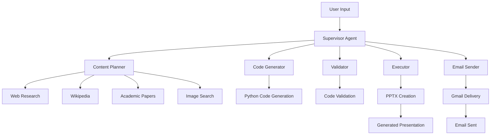

# 🤖 AI-Powered Presentation Generator

[](https://www.python.org/downloads/)
[](https://streamlit.io/)
[](https://langchain-ai.github.io/langgraph/)
[](LICENSE)

A sophisticated multi-agent AI system that automatically generates professional PowerPoint presentations using advanced language models, web research, and intelligent design templates.


## ✨ Features

### 🎯 **Intelligent Content Generation**
- **AI-Powered Research**: Automatically researches topics using web search, Wikipedia, and academic papers
- **Structured Content Planning**: Creates detailed outlines with rich, descriptive content
- **Professional Templates**: 4 sophisticated design themes (Business, Tech, Creative, Corporate)
- **Smart Image Integration**: Automatically finds and embeds relevant images from Unsplash

### 🔧 **Multi-Agent Architecture**
- **Content Planner Agent**: Researches and structures presentation content
- **Code Generator Agent**: Creates Python code for presentation generation
- **Validator Agent**: Ensures code quality and error-free execution
- **Executor Agent**: Runs code and generates the final PPTX file
- **Email Agent**: Optionally sends presentations via Gmail integration

### 🎨 **Professional Design**
- **Multiple Themes**: Business, Technology, Creative, and Corporate templates
- **Consistent Styling**: Professional color schemes, typography, and layouts
- **Image Support**: Automatic image placement with multiple layout options
- **Visual Hierarchy**: Well-structured slides with proper formatting

### 📧 **Email Integration**
- **Gmail SMTP**: Send presentations directly to recipients
- **Professional Email Templates**: Automatically generated email content
- **Attachment Support**: Seamless PowerPoint file delivery

### 🌐 **Web Interface**
- **Streamlit Dashboard**: User-friendly web interface
- **Real-time Progress**: Track generation status with live updates
- **Download Management**: Easy access to generated presentations
- **Environment Monitoring**: Visual status of API keys and dependencies

## 🏗️ Architecture

This application uses a supervisor-based multi-agent system built with LangGraph:



## 🚀 Quick Start

### Prerequisites

- Python 3.11 or higher
- OpenAI API key
- SearchAPI key (for web research)
- Gmail credentials (optional, for email features)

### Installation

1. **Clone the repository**
   ```bash
   git clone https://github.com/yourusername/ai-presentation-builder.git
   cd ai-presentation-builder
   ```

2. **Create a virtual environment**
   ```bash
   python -m venv venv
   source venv/bin/activate  # On Windows: venv\Scripts\activate
   ```

3. **Install dependencies**
   ```bash
   pip install -r requirements.txt
   ```

4. **Set up environment variables**
   ```bash
   cp env_example.txt .env
   ```
   
   Edit `.env` with your API keys:
   ```env
   # Required
   OPENAI_API_KEY=your_openai_api_key_here
   SEARCHAPI_API_KEY=your_searchapi_key_here
   
   # Optional (for email features)
   GMAIL_EMAIL=your_gmail_email
   GMAIL_APP_PASSWORD=your_gmail_app_password
   
   # Optional (for enhanced image search)
   UNSPLASH_ACCESS_KEY=your_unsplash_access_key_here
   ANTHROPIC_API_KEY=your_anthropic_api_key_here
   ```

5. **Run the application**
   ```bash
   streamlit run streamlit_app.py
   ```

6. **Open your browser**
   Navigate to `http://localhost:8501`

## 📖 Usage

### Web Interface

1. **Enter Your Topic**: Provide a detailed description of your presentation topic
2. **Configure Email** (Optional): Add recipient email for automatic delivery
3. **Generate**: Click "Generate Presentation" and watch the AI agents work
4. **Download**: Access your presentation from the web interface

### Command Line Interface

```bash
python -m app.ppt_gen.ppt_generator_agent
```

Follow the interactive prompts to generate presentations directly from the terminal.

### Example Topics

- "The Future of Artificial Intelligence in Healthcare"
- "Digital Marketing Strategies for Small Businesses"
- "Sustainable Energy Solutions for 2024"
- "Remote Work Best Practices and Tools"

## 🔧 Configuration

### API Keys Setup

#### OpenAI API Key
1. Visit [OpenAI Platform](https://platform.openai.com/api-keys)
2. Create a new API key
3. Add to your `.env` file

#### SearchAPI Key
1. Sign up at [SearchAPI](https://www.searchapi.io/)
2. Get your API key from the dashboard
3. Add to your `.env` file

#### Gmail Setup (Optional)
1. Enable 2-Factor Authentication on your Gmail account
2. Generate an App Password:
   - Go to [Google Account Settings](https://myaccount.google.com/)
   - Navigate to Security → 2-Step Verification → App passwords
   - Generate a password for "Mail"
3. Add credentials to your `.env` file

#### Unsplash API (Optional)
1. Create an account at [Unsplash Developers](https://unsplash.com/developers)
2. Create a new application
3. Copy the Access Key to your `.env` file

### Template Themes

Choose the appropriate theme for your presentation:

- **Business** (`business`): Professional blue theme for corporate, finance, consulting
- **Technology** (`tech`): Modern green theme for software, AI, innovation
- **Creative** (`creative`): Purple theme for marketing, design, startups
- **Corporate** (`corporate`): Red theme for executive presentations, board meetings

## 📁 Project Structure

```
ai-presentation-builder/
├── app/
│   ├── email/              # Email integration
│   │   ├── email_tools.py
│   │   ├── email_prompts.py
│   │   └── gmail_setup.md
│   ├── image_scrap/        # Image search and integration
│   │   ├── image_tools.py
│   │   └── image_integration.py
│   └── ppt_gen/           # Core presentation generation
│       ├── ppt_generator_agent.py
│       ├── ppt_templates.py
│       ├── prompts.py
│       └── tools_ppt.py
├── generated_presentations/ # Output directory
├── streamlit_app.py        # Web interface
├── requirements.txt        # Dependencies
├── env_example.txt        # Environment template
└── README.md              # This file
```

## 🛠️ Development

### Adding New Features

1. **New Agent**: Create in `app/` with appropriate prompts and tools
2. **New Template**: Add to `app/ppt_gen/ppt_templates.py`
3. **New Tools**: Implement in respective tool files

### Customizing Templates

Edit `app/ppt_gen/ppt_templates.py` to modify existing themes or add new ones:

```python
def create_template(theme="business"):
    # Add your custom theme logic here
    pass
```

### Environment Variables

| Variable | Required | Description |
|----------|----------|-------------|
| `OPENAI_API_KEY` | ✅ Yes | OpenAI API for language models |
| `SEARCHAPI_API_KEY` | ✅ Yes | Web search functionality |
| `GMAIL_EMAIL` | ❌ Optional | Gmail email address |
| `GMAIL_APP_PASSWORD` | ❌ Optional | Gmail app password |
| `UNSPLASH_ACCESS_KEY` | ❌ Optional | Enhanced image search |
| `ANTHROPIC_API_KEY` | ❌ Optional | Alternative AI model |

## 🐛 Troubleshooting

### Common Issues

**1. Module Import Errors**
```bash
pip install -r requirements.txt
```

**2. API Key Issues**
- Verify all required keys are set in `.env`
- Check API key validity and usage limits

**3. Email Sending Failures**
- Ensure 2FA is enabled on Gmail
- Verify app password is correctly generated
- Check internet connection

**4. Template Errors**
- Ensure `ppt_templates.py` is in the Python path
- Verify template theme names are correct

### Logs and Debugging

- Check `ppt_generator.log` for detailed execution logs
- Use the Streamlit interface for real-time error monitoring
- Enable workflow details in the sidebar for step-by-step debugging

## 🤝 Contributing

We welcome contributions! Please see our [Contributing Guidelines](CONTRIBUTING.md) for details.

### Development Setup

1. Fork the repository
2. Create a feature branch: `git checkout -b feature-name`
3. Make your changes
4. Add tests if applicable
5. Submit a pull request

### Code Style

- Follow PEP 8 guidelines
- Add docstrings to all functions
- Include type hints where appropriate
- Write comprehensive comments

## 📄 License

This project is licensed under the MIT License - see the [LICENSE](LICENSE) file for details.

## 🙏 Acknowledgments

- **LangGraph**: For the multi-agent framework
- **OpenAI**: For powerful language models
- **Streamlit**: For the excellent web framework
- **Python-PPTX**: For PowerPoint generation capabilities
- **Unsplash**: For high-quality images

## 📞 Support

- **Issues**: [GitHub Issues](https://github.com/yourusername/ai-presentation-builder/issues)
- **Discussions**: [GitHub Discussions](https://github.com/yourusername/ai-presentation-builder/discussions)
- **Email**: your-email@example.com

## 🔄 Version History

- **v1.0.0** (2024-09-21): Initial release with multi-agent system
- **v0.9.0** (2024-09-20): Beta release with core functionality
- **v0.8.0** (2024-09-19): Alpha release with basic features

---

<div align="center">
  <strong>Built with ❤️ using AI and modern Python technologies</strong>
  <br>
  <sub>Generate professional presentations in minutes, not hours</sub>
</div>
